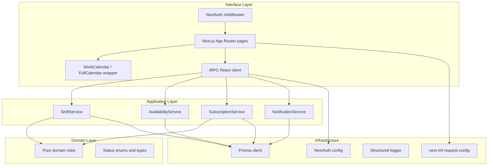

# Technical Design — Work Calendar

## Stack rationale

| Layer | Choice | Why |
|-------|--------|-----|
| Framework | Next.js 15 (App Router) + TypeScript strict | Full-stack typed monolith, file-based routing, server actions, edge-friendly |
| API | tRPC v11 | End-to-end types with Zod input validation; no DTO drift between server and client |
| DB | PostgreSQL 16 | Relational integrity, range queries, row-level transactions for approvals |
| ORM | Prisma 6 | Schema-driven migrations, typed queries, seed scripts |
| Auth | NextAuth v4 (Credentials + bcrypt) | Session cookies, role + businessId on JWT; pluggable for OAuth later |
| Calendar | FullCalendar v6 | Accessible, battle-tested calendar with day/week/month views and time-block events |
| i18n | next-intl v3 | Request-scoped messages with English default and Dutch scaffold |
| Validation | Zod 3 | Shared schemas at API and form boundaries |
| Tests | Vitest 3 + Playwright | Fast unit/integration with jsdom; browser-level E2E |
| Logging | Structured JSON logger | Stable event names per business action |

## Architecture



## Folder structure

```
src/
  app/                       Next.js routes
    api/                     /api/auth + /api/trpc handlers
    calendar/                Owner & worker calendar page
    notifications/           Notification inbox
    login/, register/        Auth pages
  domain/                    Pure logic (no I/O)
    types.ts
    rules/scheduling.ts
  application/               Use cases (orchestration + audit + notifications)
    services/
  infrastructure/
    db/prisma.ts
    auth/auth-options.ts
    logging/logger.ts
  interface/
    trpc/                    Routers, context, role procedures, schemas
    providers/               Auth + tRPC React providers
    components/              WorkCalendar (FullCalendar), dialogs, primitives
  i18n/request.ts            next-intl request config
  lib/                       Pure helpers (calendar event mapping, status colors)
messages/{en,nl}.json        Translations
prisma/                      Schema, migrations, seed
tests/                       Unit, integration, E2E suites
docs/                        PRD, technical design, API, UX
```

## Data model

See [`prisma/schema.prisma`](../prisma/schema.prisma). Key relationships:

- **Business** 1—N **User** (workers), 1—1 owner via `Business.ownerId`
- **Shift** belongs to Business; has `requiredSpots`, `status`
- **Availability** worker + time range
- **ShiftSubscription** worker applies to shift (`PENDING` → `APPROVED` | `REJECTED` | `WITHDRAWN`)
- **ShiftAssignment** materialized on approval (worker ⇄ shift)
- **Notification** typed event for a user; `readAt` nullable for unread badge
- **AuditEvent** append-only log keyed by `entityType + entityId`

### Indexes
- `Shift(businessId, startsAt, endsAt)` — range queries for calendar
- `Availability(userId, startsAt, endsAt)` — overlap checks
- `ShiftSubscription(shiftId, status)` — pending queue
- `ShiftSubscription(userId, status)` — worker dashboard
- `Notification(userId, readAt)` — unread count

## API contract

See [`docs/API.md`](API.md). All routers live under `/api/trpc` and are typed end-to-end. Every input is validated via Zod and every write is scoped to the caller's `session.user.businessId` to prevent IDOR.

| Router | Procedures | Role |
|--------|-----------|------|
| `auth` | `register` | public |
| `business` | `get` | authenticated |
| `shift` | `list`, `create`, `update`, `delete` | owner write, both read |
| `availability` | `list`, `set`, `delete` | worker |
| `subscription` | `submit`, `withdraw`, `listForShift`, `approve`, `reject` | role-split |
| `notification` | `list`, `unreadCount`, `markRead`, `markAllRead` | authenticated |

## Business rules

1. **Capacity** — `approvedCount < shift.requiredSpots` before approval.
2. **Overlap** — a worker may not be approved for two shifts whose time ranges overlap.
3. **Withdraw** — only PENDING subscriptions transition to WITHDRAWN.
4. **Approve/Reject** — only PENDING subscriptions, only by the shift's owner.
5. **Subscribe** — shift must not be CANCELLED or FILLED; worker may not already hold an active (PENDING / APPROVED) subscription. REJECTED and WITHDRAWN allow re-applying.
6. **IDOR** — every read and write checks `businessId` matches the caller's session.

## Transactions

`SubscriptionService.approve` wraps capacity re-check, status update, assignment creation, FILLED transition, notification, and audit event in a single `prisma.$transaction`. This prevents two simultaneous approvals from exceeding capacity under a race.

## Calendar rendering

[`WorkCalendar`](../src/interface/components/work-calendar.tsx) is a thin wrapper around FullCalendar configured with `dayGridMonth`, `timeGridWeek`, and `timeGridDay` views, drag-select, and a custom event renderer. Domain → FullCalendar event mapping lives in [`src/lib/calendar-events.ts`](../src/lib/calendar-events.ts) as pure functions so the mapping is unit-testable independent of the calendar widget.

## Internationalization

[`src/i18n/request.ts`](../src/i18n/request.ts) resolves the locale per request from (1) the `NEXT_LOCALE` cookie, (2) the `Accept-Language` header, or (3) the default `en`. English and Dutch message bundles live in [`messages/`](../messages). A unit test guarantees the Dutch bundle covers every key in the English baseline.

## Security

- HttpOnly session cookies (NextAuth defaults; `secure: true` enforced in production by Auth.js).
- All mutations require an authenticated session through `protectedProcedure`.
- Role guards (`ownerProcedure`, `workerProcedure`) implemented as tRPC middlewares.
- Business-scoped queries on every read and write to prevent insecure direct object reference.
- Structured logging on auth, approval, rejection, and shift mutations.
- Rate limiting documented at the reverse proxy boundary (e.g., Cloudflare or nginx limit_req for `/api/auth/*` and tRPC mutation endpoints).

## Large-file split strategy

When a file grows past ~450 lines, split incrementally rather than in one big refactor:

1. **Extract side-effects first** — e.g. Dimona hooks live in [`dimona-hooks.ts`](../src/application/services/dimona-hooks.ts) so assignment services stay focused on transactions.
2. **Sibling folder per oversized file** — create `components/app-header/` or `app/calendar/components/` next to the parent file; move sub-components and hooks there; keep the original path as a thin re-export if needed.
3. **No behaviour change** — splits are structural only; covered by existing tests before and after.
4. **Touch-only rule** — only split files modified in the current change set; document other candidates here without refactoring them preemptively.

**Documented candidates (no split required yet):**

| File | Lines (approx.) | Suggested extraction |
|------|-----------------|----------------------|
| `app-header.tsx` | 613 | `SettingsMenu`, `MobileDrawer`, `BusinessSwitcher` |
| `calendar-client.tsx` | 596 | dialog + toolbar hooks |
| `time-entries-client.tsx` | 536 | filter bar, bulk actions |
| `me-home-client.tsx` | 488 | already has inline `StatCard`; extract `AvailabilityStrip` |
| `shift-detail-dialog.tsx` | 465 | tabs: details / chat / assignments |

**Applied in Dimona/contracts pass:** `shift-assignment-service.ts` — Dimona side-effects moved to `dimona-hooks.ts`.

